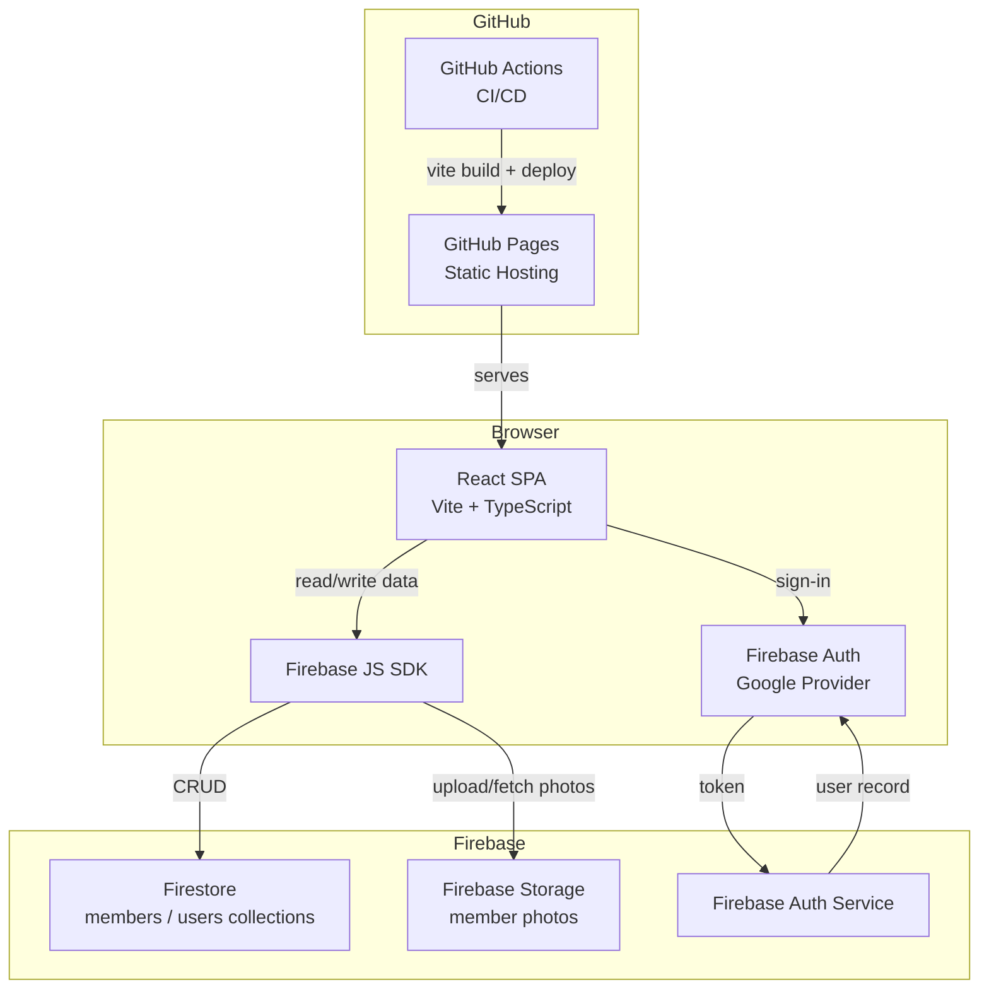
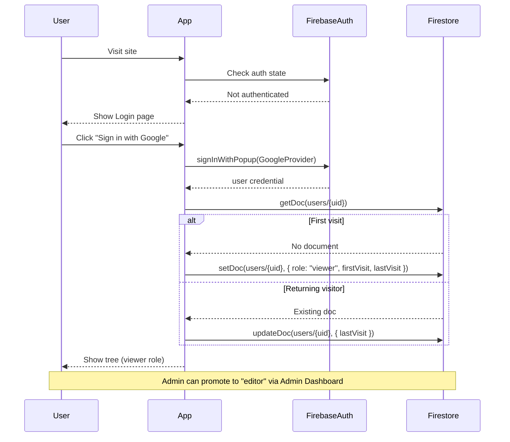

# Gorguissian Family Tree

An interactive family tree web application for the Gorguissian family, built with React, TypeScript, and Firebase.

## Features

- 🌳 Interactive tree visualization with zoom, pan, and expand/collapse
- 🔐 Google sign-in — access requires authentication
- 👤 Per-member profiles: photo, location, birth year, bio
- ✏️ Editors can update member information and upload photos
- 🛡️ Admin dashboard to manage visitor access and promote editors
- 📊 Visitor tracking (first visit, last visit)

## Architecture



### Auth & Role Flow



## Tech Stack

| Layer | Technology |
|-------|-----------|
| Frontend | React 18 + Vite + TypeScript |
| Styling | Tailwind CSS |
| Tree visualization | react-d3-tree |
| Auth | Firebase Authentication (Google) |
| Database | Cloud Firestore |
| File storage | Firebase Storage |
| Hosting | GitHub Pages |
| CI/CD | GitHub Actions |

## Roles

| Role | Can View Tree | Can Edit Members | Can Manage Users |
|------|:---:|:---:|:---:|
| `viewer` | ✅ | ❌ | ❌ |
| `editor` | ✅ | ✅ | ❌ |
| `admin` | ✅ | ✅ | ✅ |

Visitors are assigned `viewer` on first sign-in. The admin promotes users to `editor` via the Admin Dashboard.

## Local Development

### Prerequisites

- Node.js 20+
- A Firebase project (see [docs/ARCHITECTURE.md](docs/ARCHITECTURE.md) for setup)

### Setup

```bash
# Install dependencies
npm install

# Copy env template and fill in your Firebase config
cp .env.example .env.local

# Start dev server
npm run dev
```

### Seed Firestore (first time only)

```bash
# Run the seed script to populate Firestore with all family members
npm run seed
```

### Deploy

Deployment is automated via GitHub Actions on push to `main`. See [`.github/workflows/deploy.yml`](.github/workflows/deploy.yml).

To deploy manually:

```bash
npm run build
# Then push the dist/ output to gh-pages branch, or let CI handle it
```

## Project Structure

```
src/
├── components/
│   ├── MemberNode.tsx      # Custom tree node renderer
│   ├── MemberPanel.tsx     # Slide-in member detail/edit panel
│   └── TreeView.tsx        # react-d3-tree wrapper
├── contexts/
│   └── AuthContext.tsx     # Auth state + role provider
├── data/
│   └── familyTree.json     # Seed data (all family members)
├── pages/
│   ├── AdminPage.tsx       # Admin dashboard
│   └── LoginPage.tsx       # Google sign-in screen
├── scripts/
│   └── seedFirestore.ts    # One-time Firestore seed script
├── services/
│   ├── firestoreService.ts # Firestore CRUD operations
│   └── storageService.ts   # Firebase Storage photo operations
├── types/
│   └── index.ts            # TypeScript interfaces
├── App.tsx
├── firebase.ts             # Firebase app initialization
└── main.tsx
docs/
├── ARCHITECTURE.md         # Detailed architecture & schema docs
└── PLAN.md                 # Phased implementation plan with progress
```
